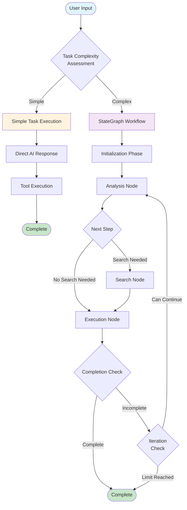
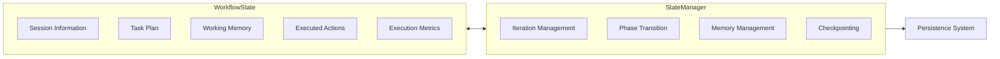
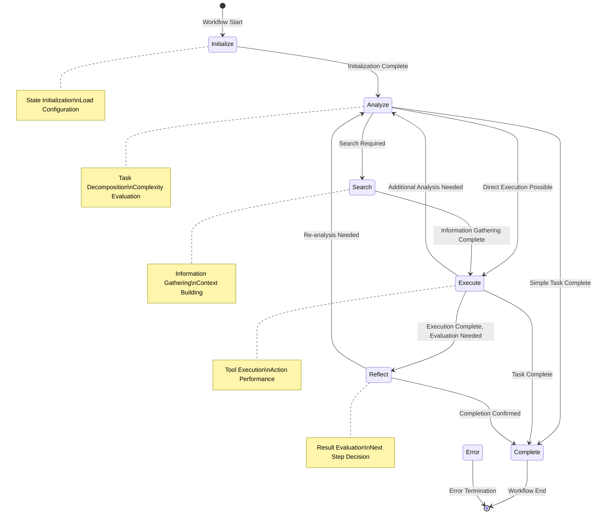
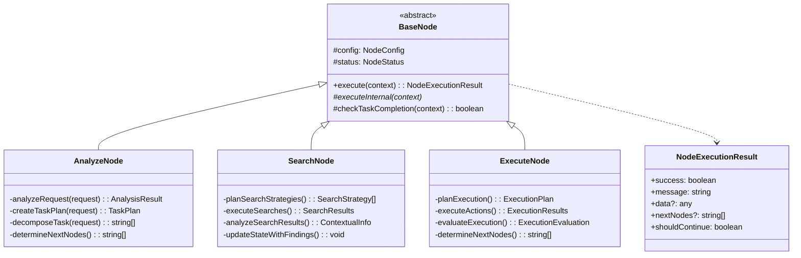
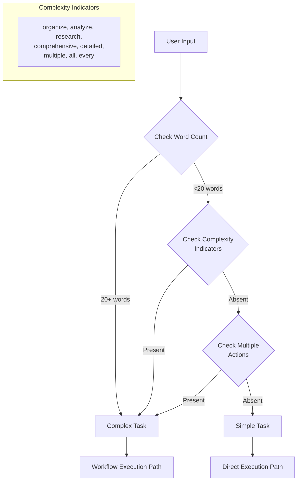
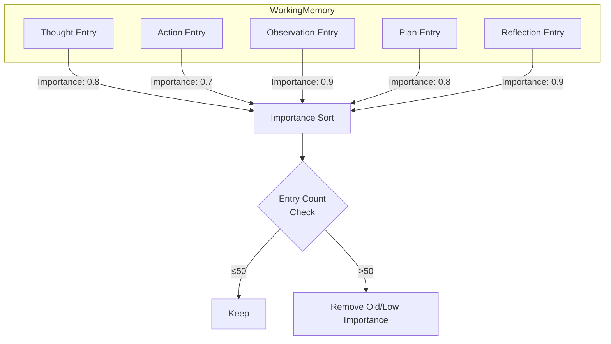
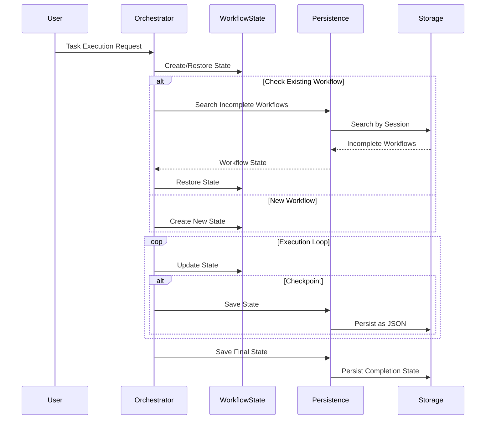
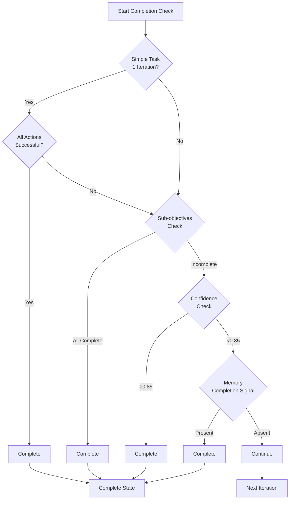

# LangGraph-Style Workflow System

## Overview

Obsius implements a state-driven workflow system inspired by LangGraph. This system processes complex tasks step by step, making appropriate decisions at each stage while aiming for completion within a maximum of 24 iterations.

## Overall Workflow Diagram



## State Management System



## Phase Transition Diagram



## Node Architecture



## Task Complexity Assessment Flow



## Memory Management System



## Persistence and Recovery



## Completion Detection Logic



## Configurable Parameters

| Parameter | Default Value | Description |
|-----------|---------------|-------------|
| MAX_ITERATIONS | 24 | Maximum number of iterations |
| ITERATION_TIMEOUT_MS | 30000 | Timeout per iteration |
| MAX_WORKING_MEMORY_ENTRIES | 50 | Maximum entries in working memory |
| PERSISTENCE_INTERVAL_MS | 5000 | Auto-persistence interval |
| MAX_STATE_SIZE | 1MB | Maximum size of persisted state |

## Usage Examples

### Simple Task Processing Flow
```
User: "Create a note about AI"
↓
Complexity Assessment: Simple
↓
Direct Execution Path
↓
AI Response Generation + Tool Execution
↓
Complete
```

### Complex Task Processing Flow
```
User: "Organize all my machine learning notes and create a comprehensive index"
↓
Complexity Assessment: Complex
↓
StateGraph Workflow Start
↓
Analysis Node: Task Decomposition (8 subtasks)
↓
Search Node: Related Notes Search
↓
Execution Node: Note Organization & Index Creation
↓
Completion Check → Continue Decision
↓
(Repeat as needed)
↓
Complete
```

## Summary

This LangGraph-style workflow system selects the appropriate processing path based on task complexity, ensuring robust execution through state management and persistence. Simple tasks are processed immediately, while complex tasks are decomposed and executed step by step, achieving efficient and reliable task completion.